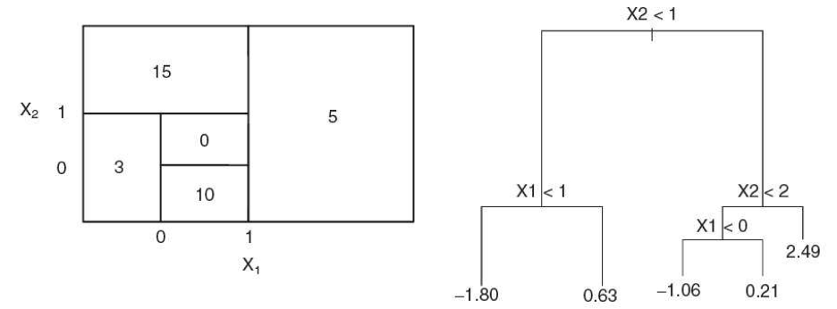

```{r setup, include=FALSE}
knitr::opts_chunk$set(echo = TRUE)
```

# 1 Trees

(a) Draw a tree diagram corresponding to the partition of the predictor space shown the left-hand panel of Figure 1. The numbers inside the boxes indicate the mean of Y within each region.

<!-- -->

(b) Look at the tree in the right-hand panel of Figure 1. Based on this tree, create a diagram similar to the left-hand panel of this figure where you divide the predictor space into the correct regions, and indicate the mean for each region.



# 2. Bagging

Suppose we produce ten bootstrapped samples from a data set containing equal numbers of two classes red and green. We then apply a classification tree to each bootstrapped sample and, for a specific value of X, produce 10 estimates of *P*(Class is Red*\|X*):

0*.*1*,* 0*.*15*,* 0*.*2*,* 0*.*2*,* 0*.*55*,* 0*.*6*,* 0*.*6*,* 0*.*65*,* 0*.*7*,* and 0*.*75*.*

There are two common ways to combine these results together into a single class prediction.

• One is the majority vote approach.

• The second approach is to classify based on the average probability.

In this example, what is the final classification for each approach?

Popular vote approach: 0.60 is the most common probability $\rightarrow$ Red

Avg probability: (0*.*1+ 0*.*15 + 0*.*2 + 0*.*2+0*.*55+ 0*.*6+0*.*6 + 0*.*65+0*.*7+ 0*.*75)/10 = 0.45 $\rightarrow$ Green

```{r}
(0.1 + 0.15 + 0.2 + 0.2 + 0.55 + 0.6 + 0.6 + 0.65 + 0.7 + 0.75)/10
```

# 3. Orange Juice Purchases

This problem involves the OJ (orange juice) data set which is part of the ISLR2 package. To find its description, run the following codes.

```{r}
library(ISLR2) 
head(OJ)
library(tree)
```

(a) Create a training set containing a random sample of 800 observations, and a test set containing the remaining observations. Use set.seed(2023).

    ```{r 3a}
    set.seed(2023)
    n <- nrow(OJ)
    train_indices <- sample(seq_len(n), size = 800)
    train_set <- OJ[train_indices, ]
    test_set <- OJ[-train_indices, ]

    cat("Number of observations in the training set:", nrow(train_set), "\n")
    cat("Number of observations in the test set:", nrow(test_set), "\n")
    ```

(b) Use the tree package to fit a tree to the training data, with Purchase as the response and the other variables as predictors. Use the summary() to produce summary statistics about the tree, and describe the results obtained. Which variables are used in the tree? What is the training error rate? Do the variables make sense to you?

```{r 3b}
tree_model <- tree(Purchase ~ ., data = train_set)
summary(tree_model)

train_pred <- predict(tree_model, train_set, type = "class")

conf_matrix <- table(Predicted = train_pred, Actual = train_set$Purchase)

train_error_rate <- 1 - sum(diag(conf_matrix)) / sum(conf_matrix)
train_error_rate

```

**Remark:** Several variables, such as StoreID, Store7, STORE, should be treated as factors. Furthermore, they are correlated. But since the tree-methods can select variables, we will use the predictors as is for now.

(c) Type in the name of your tree object to get a detailed text output. Pick one of the terminal nodes, and interpret the information displayed. How many decisions were made for that terminal node?

    ```{r 3c}
    tree_model
    ```

    Node interpreting: Node 7 shows the output line for node 7 shows that if a customers loyalty to Citrus Hill was greater than 0.754, in those 267 instances 95.1% of customers bought CH with a deviance of 103.90.

(d) Create a plot of the tree.

    ```{r 3 d}
    plot(tree_model)
    text(tree_model, pretty = 0)
    ```

(e) Predict the response on the test data, and produce a confusion matrix comparing the test labels to the predicted test labels. What is the test error rate?

    ```{r 3e}
    test.pred <- predict(tree_model, newdata=test_set, type = "class")
    table(test.pred, test_set$Purchase)
    noquote(paste("The test error rate on the OJ data is", 
                  round(mean(test.pred != test_set$Purchase), 2)))
    ```

(f) Apply the cv.tree() function to the training set in order to determine the optimal tree size based on the misclassification rate. Use set.seed(2023).

    ```{r 3f}
    cv.trainoj <- cv.tree(tree_model, FUN = prune.misclass, K=10)
    cv.trainoj
    ```

(g) Produce a plot with tree size on the x-axis and cross-validated classification error rate on the y-axis.

    ```{r 3g}
    plot(cv.trainoj$size, cv.trainoj$dev, type = "b")
    ```

(h) Which tree size corresponds to the lowest cross-validated classification error rate?

    The optimal tree size is 2

(i) Produce a pruned tree corresponding to the optimal tree size obtained using cross-validation. **In addition**, create a pruned tree with **four** terminal nodes.

    ```{r 3i}
    prune.oj <- prune.misclass(tree_model, best = 2)
    plot(prune.oj)
    text(prune.oj, pretty = 0)

    prune.oj2 <- prune.misclass(tree_model, best = 4)
    plot(prune.oj2)
    text(prune.oj2, pretty = 0)
    ```

(j) Compare the training error rates between the pruned and unpruned trees. Which is higher?

    ```{r 3j}
    summary(prune.oj)
    ```

    The pruned trees error rate is 19.12% while the unpruned tree error rate is 16.25% so the pruned tree has a higher training error rate.

(k) Compare the test error rates between the pruned and unpruned trees. Which is higher?

    ```{r 3k}
    test.pred2 <- predict(prune.oj, newdata=test_set, type = "class")
    table(test.pred2, test_set$Purchase)
    noquote(paste("The test error rate on the OJ pruned data is", 
                  round(mean(test.pred2 != test_set$Purchase), 2)))
    ```

The test error rate on the pruned data is higher by about 0.03 than the unpruned data.

# 4. Hyperplane (line for 2-dimension)

This problem involves a hyperplane in two dimensions. Sketch the hyperplane 1 + 3$X_1$ - $X_2$ = 0. Indicate the set of points for which 1 + 3$X_1$ *-* $X_2$ \>0, as well as the set of points for which 1 + 3$X_1$ *-* $X_2$ \<0.

```{r 4}
library(ggplot2)

hyperplane <- function(x1) {
  1 + 3 * x1
}

x1_vals <- seq(-10, 10, by = 0.1)

df <- data.frame(
  X1 = x1_vals,
  X2 = hyperplane(x1_vals)
)

ggplot(data = df, aes(x = X1, y = X2)) +
  geom_line(color = "blue", size = 1) +
  geom_ribbon(aes(ymin = -Inf, ymax = X2), fill = "red", alpha = 0.3) +  # Region where 1 + 3X1 - X2 < 0
  geom_ribbon(aes(ymin = X2, ymax = Inf), fill = "green", alpha = 0.3) +  # Region where 1 + 3X1 - X2 > 0
  labs(
    title = "Hyperplane and Regions",
    x = "X1",
    y = "X2"
  ) +
  theme_minimal()

```

Region where 1 + 3X1 - X2 \< 0 is red, region where 1 + 3X1 - X2 \> 0 is green

# 5. Maximal Margin Classifier

Here we explore the maximal margin classifier on a toy data set.

| Obs | X1  | X2  | Y    |
|-----|-----|-----|------|
| 1   | 3   | 4   | Red  |
| 2   | 2   | 2   | Red  |
| 3   | 4   | 4   | Red  |
| 4   | 1   | 4   | Red  |
| 5   | 2   | 1   | Blue |
| 6   | 4   | 3   | Blue |
| 7   | 4   | 1   | Blue |

The data and the optimal separating hyperplane, $X_1$ -$X_2$ *-* 0*.*5 = 0, are sketched in the scatter plot.

```{r}
X1 <- c(3,2,4,1,2,4,4)
X2 <- c(4,2,4,4,1,3,1)
Y <- c(rep("red",4), rep("blue",3)) 
par(pty="s")

plot(X1, X2, pch=16, col=Y, xlim=c(0,5), ylim=c(0,5), xlab="X1", ylab="X2") 
abline(a=-0.5, b=1, lwd=3)

```

(a) Identify the support vectors (there are 4) for the maximal margin classifier. What is the margin of the classifier?

    Using the notation (x1, x2, Y) – (2,1, Blue), (2,2, Red), (4,3, Blue), (4, 4, Red). The margin of the classifier is 0.5.

(b) Argue that a slight movement of the seventh observation ($X_1$, $X_2$ , Y) = (4*,* 1*, Blue*) would not affect the maximal margin hyperplane.

    A slight movement of the seventh observation would not affect the MMH, because it is not one of the support vectors, and assuming it only moves slightly it will not become one.

(c) Draw an additional observation on the plot so that the two classes are no longer separable by a hyperplane.

# 6. SVM with application in Auto data

In this problem, you will use support vector approaches in order to predict whether a given car gets high or low gas mileage based on the Auto data set in the ISLR2 package.

(a) Create a binary variable that takes on a 1 for cars with gas mileage above the median, and a 0 for cars with gas mileage below the median.

    ```{r 6a}
    library(tidyverse)
    library(ISLR2)
    auto.data <- Auto
    auto.data <- auto.data %>%
      mutate(mpg_binary = ifelse(mpg > median(mpg), 1, 0))
    auto.data %>%
      group_by(mpg_binary) %>%
      summarize(count = n())
    ```

(b) Fit a support vector classifier (i.e., SVM with linear kernel) to the data, in order to predict whether a car gets high or low gas mileage. Use the following variables in the Auto data set: cylinders, displacement, horsepower, weight, acceleration, and year. Report the 10-fold cross-validation error. (You can use the default cost value.)

    ```{r 6b}
    library(boot)
    library(e1071)
    auto.svm.lin <- svm(as.factor(mpg_binary) ~ cylinders + displacement + horsepower + weight + acceleration + year, kernel="linear", data=auto.data)

    set.seed(2023)
    svm.tuning.linear <- tune(svm, mpg_binary ~ cylinders + displacement + horsepower + weight + acceleration + year, data = auto.data, kernel = "linear")

    summary(svm.tuning.linear)
    ```

(c) Repeat (b), using SVMs with radial and polynomial basis kernels. Use the default values for cost, gamma and degree in the svm() function. Comment on your results.

    ```{r 6c}
    auto.svm.rad <- svm(as.factor(mpg_binary) ~ cylinders + displacement + horsepower + weight + acceleration + year, kernel="radial", data=auto.data)

    set.seed(2023)
    svm.tuning.radial <- tune(svm, mpg_binary ~ cylinders + displacement + horsepower + weight + acceleration + year, data = auto.data, kernel = "radial")

    summary(svm.tuning.radial)

    auto.svm.pol <- svm(as.factor(mpg_binary) ~ cylinders + displacement + horsepower + weight + acceleration + year, kernel="polynomial", data=auto.data)

    set.seed(2023)
    svm.tuning.pol <- tune(svm, mpg_binary ~ cylinders + displacement + horsepower + weight + acceleration + year, data = auto.data, kernel = "polynomial")

    summary(svm.tuning.pol)
    ```

    The radial 10-fold error rate is just better than 7%, while the polynomial CV error rate is over 15.5%, this indicated a radial boundary as the best fit between the three options

(d) Make some plots to illustrate your results from (b) and (c). When *p \>* 2, you can use the plot() function to create plots displaying one pair of variables at a time. For example, to plot horsepower

    ```{r 6d}
    plot(auto.svm.pol, data=auto.data, cylinders ~ displacement)
    plot(auto.svm.rad, data = auto.data, horsepower ~ weight)
    plot(auto.svm.lin, data=auto.data, acceleration ~ cylinders)
    plot(auto.svm.pol, data = auto.data, year ~ weight)
    plot(auto.svm.rad, data = auto.data, weight ~ displacement)
    plot(auto.svm.lin, data=auto.data, weight ~ year)
    ```

and year the syntax is

```{r}
# plot(auto.svmlin, data=auto.data, horsepower ~ year)
```

# 7. Stat 627. Non-linear boundary in SVM

We have seen that in *p* = 2 dimensions, a linear decision boundary takes the form $\beta_0$ + $\beta_1$ $X_1$ + $\beta_2$ $X_2$ = 0. We now investigate a non-linear decision boundary.

Suppose a classifier assigns an observation to the *BLUE* class if ($X_1$+ 1)^2^ + ($X_2$ -2)^2^ \>4

, and to the *RED* class otherwise.

(a) Sketch the boundary. Verify that the boundary is a circle. You do not need to attach the plot. Instead, report the following:

• The center of the circle. (Report in terms of ($X_1$, $X_2$) coordinate.) = (-1,2)

• The radius of the circle. = $\sqrt4$ = 2

• Is the *BLUE* class inside or outside the circle? The BLUE class is outside the circle and the RED class is inside the circle.

(b) To what class the following observations are classified?

• (0, 0) = BLUE

• (-1, 1) = RED

• (2, 2) = BLUE

• (3, 8) = BLUE
